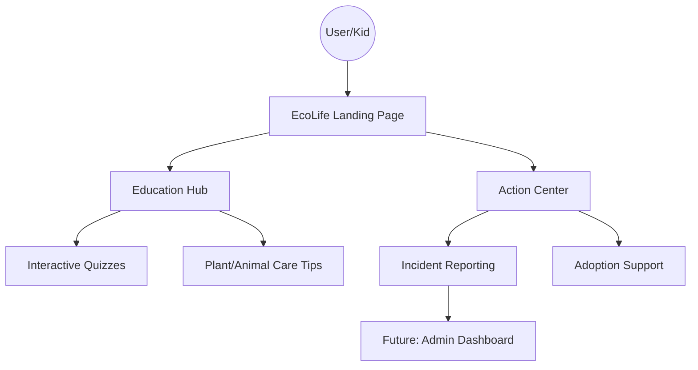

# 🌍 EcoLife – Environment & Animal Safety Hub

<div align="center">


**EcoLife** is a centralized, interactive platform designed to bridge the gap between environmental activism and animal welfare. Through gamified learning, reporting tools, and community action, we empower everyone—from kids to experts—to protect our planet.

[Explore Demo](#-ui-preview) • [Report an Issue](https://github.com/Jagrati3/Environment_Animal_Safety_Hub/issues) • [Join Discord](https://discord.gg/3FKndgyuJp)

</div>

---

## 📖 Quick Overview
EcoLife addresses the lack of accessible, unified resources for environmental and animal safety. By combining educational modules (Quizzes), actionable guides (Waste/Plant Care), and reporting systems, the project serves as a "Digital Eco-Guardian" for local communities.

---

## 🚀 ECWOC 2026 Contributor Onboarding
We are thrilled to be part of **Extreme Community Winter of Code 2026!** ### 🚨 Mandatory Steps
1. **Register:** You **MUST** complete the [Contributor Registration Form](https://forms.gle/2aVtenoaHg65qi4G7) before submitting PRs.
2. **Join the Community:** Hop into our [Discord Server](https://discord.gg/3FKndgyuJp) for mentorship and discussion.
3. **Claim an Issue:** Look for issues labeled `ECWOC'26` or `good-first-issue`.

---

## ✨ Feature Pillars
EcoLife is structured into three core impact areas:

### 🐾 Animal & Wildlife Safety
* **Adoption Portal:** Support and adopt stray animals.
* **Wildlife Protection:** Educational resources on endangered species.
* **Safe Feeding:** Guidelines on how to feed animals responsibly.

### 🗑 Environmental Action
* **Waste Segregation:** Interactive guides on the 3 Rs (Reduce, Reuse, Recycle).
* **Climate Awareness:** Tools to calculate and reduce your carbon footprint.
* **Community Clean-ups:** Reporting system for local environmental hazards.

### 🎯 Education & Awareness
* **Kids Quiz Section:** A fun, interactive way for children to learn sustainability.
* **Plant Care:** Beginner-friendly tips for maintaining local flora.

---

## 🏗 Project Architecture
Understanding how a user interacts with the EcoLife hub:



---

## 🛠 Tech Stack
We use a lightweight, accessible stack to ensure maximum performance and ease of contribution.

| Technology | Role | Context |
| :--- | :--- | :--- |
| **HTML5** | Structure | Semantic layout for accessibility and SEO. |
| **CSS3** | UI/UX | Custom styles, responsive grid, and eco-themed aesthetics. |
| **JavaScript** | Interactivity | Logic for quizzes, dynamic reporting forms, and UI toggles. |

---

## 📸 UI Preview

<div align="center">
  
  
  
</div>

> _Visual interface featuring the cyberpunk-eco dashboard, the investigation module, and the interactive learning center._

---

## 🤝 Getting Started for Contributors

If you are new to the project, follow these steps to set up your local environment and begin contributing.

### Local Setup
**1. Clone the repository**
```
git clone [https://github.com/Jagrati3/Environment_Animal_Safety_Hub.git](https://github.com/Jagrati3/Environment_Animal_Safety_Hub.git)
```

**2. Navigate to the folder**
```
cd Environment_Animal_Safety_Hub
```

**3. Open index.html in your browser**
```
# (No heavy installation or build steps required!)
```

### 💡 Potential Contribution Ideas
We welcome all types of improvements! Here are some areas where you can make an immediate impact:

* **🎨 Frontend:** Implement a toggle for **Dark Mode** or refine the UI with smooth **CSS animations**.
* **🧠 Features:** Expand the **Quiz question bank** or add new educational modules.
* **♿ Accessibility:** Improve **ARIA labels** and keyboard navigation to ensure the platform is inclusive for all users.
* **📱 Responsiveness:** Optimize the mobile view for the reporting forms and interactive maps.

---

## 👥 Contributors

We appreciate the dedication and hard work of everyone involved in the EcoLife initiative!

### 🌟 Core Team

| Name | Role |
| :--- | :--- |
| **Jagrati** | Project Owner & Lead Developer |
| **Nikhil Singh** | Mentor |

### 🌍 Community Contributors

We are proud to be supported by a growing community of developers and environmental enthusiasts.

<a href="https://github.com/Jagrati3/Environment_Animal_Safety_Hub/graphs/contributors">
  
</a>

---

## 🗺 Future Enhancements (Roadmap)

We are constantly looking to expand EcoLife's impact. Here are the milestones we are heading toward:

- [ ] **🔐 Auth System:** User login to save personal progress and track quiz scores.
- [ ] **📊 Admin Dashboard:** Centralized management system for viewing and responding to environmental reports.
- [ ] **📈 Infographics:** Integration of animated data visualizations for real-time climate change tracking.
- [ ] **🌐 Multilingual Support:** Making the platform accessible in local languages to reach a global audience.


---

## 📜 License

This project is licensed under the **MIT License**. Created for education & awareness purposes only. 

For more details, please see the [LICENSE](./LICENSE) file.

---

<div align="center">
  <h3>Give a ⭐ if you support a greener Earth! 🌏💚</h3>
  <p>Your support helps us reach more people and protect more lives.</p>
</div>
